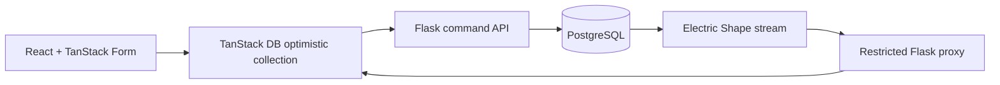

# linxVoice

`linxVoice` is a production-shaped reference application for a deliberately small domain: one shared, real-time Todo list. It demonstrates a complete optimistic data loop without hiding the boundaries between commands, durable state, replication, and local reactive queries.



## Stack

- Python 3.13, APIFlask, Pydantic, SQLAlchemy 2, Alembic, psycopg 3
- React 19 and Vite
- TanStack Router, Query, DB, and Form
- Electric with PostgreSQL 17 logical replication
- OpenAPI-generated TypeScript SDK and Zod schemas
- pytest, Vitest/React Testing Library, and Playwright

## Prerequisites

- Docker with Compose
- Node.js 24 and Corepack
- [`uv`](https://docs.astral.sh/uv/)
- GNU Make

## Start locally

```sh
cp .env.example .env
make setup
make infra-up
make migrate
make seed       # optional
make dev
```

Open [http://localhost:5173/todos](http://localhost:5173/todos). Open a second browser window to see changes propagate. API documentation is available at [http://localhost:5000/docs](http://localhost:5000/docs).

`make dev` intentionally checks infrastructure and migrations before starting Flask and Vite. Migrations never run implicitly during application startup.

## Commands

| Command | Purpose |
| --- | --- |
| `make setup` | Install locked Python and frontend dependencies |
| `make infra-up` / `make infra-down` | Start or stop PostgreSQL and Electric |
| `make migrate` | Apply Alembic migrations explicitly |
| `make seed` | Add deterministic sample Todos idempotently |
| `make dev` | Run infrastructure, migrations, Flask, and Vite |
| `make generate` | Regenerate OpenAPI, SDK, and Zod schemas |
| `make check` | Run formatting, linting, and strict type checks |
| `make test` | Run backend and frontend coverage suites |
| `make test-e2e` | Run real-stack Playwright scenarios |
| `make hooks` | Opt in to local pre-commit hooks |

## Contract and synchronization

Todo reads come only from the Electric-backed TanStack DB collection. Flask exposes versioned command endpoints and a fixed Todo shape proxy; it never accepts arbitrary table, column, or filter parameters.

Every mutation:

1. updates the TanStack DB collection optimistically;
2. calls Flask using the generated SDK;
3. commits to PostgreSQL with validation and an `If-Match` version check;
4. returns the raw replication `txid` from the same transaction;
5. remains optimistic until Electric broadcasts that `txid` back.

Stale writes return `412 Precondition Failed`. A confirmation timeout is presented as “Saved, sync delayed,” because a missing replication acknowledgement does not prove the database write failed.

See [architecture](docs/architecture.md) and the [decision records](docs/adr) for the boundaries and deliberate tradeoffs.

## Deliberate limits

This is not a deployed product. It has no authentication, user isolation, durable offline mutation queue, server-side rendering, service worker, cloud configuration, or telemetry vendor. The entire Todo table is one shared shape. Those omissions are explicit so the reference remains focused on the data flow.

## Troubleshooting

- **`awaitTxId` times out:** ensure the API reads `pg_current_xact_id()::xid::text` inside the same SQL transaction as the mutation. Enable client logging with `localStorage.debug = 'ts/db:electric'`.
- **Electric never becomes live:** confirm Docker is running, PostgreSQL reports healthy, migrations have created `todos`, and port 3000 is free.
- **Generated files differ:** run `make generate` and commit both `openapi.json` and `frontend/src/api/generated`.
- **Ports are busy:** defaults are PostgreSQL `54321`, Electric `3000`, Flask `5000`, and Vite `5173`.

## License

[MIT](LICENSE)

